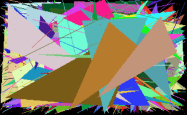

# multirender [](https://travis-ci.org/xyproto/multirender) [](http://godoc.org/github.com/xyproto/multirender) [](https://raw.githubusercontent.com/xyproto/multirender/master/LICENSE) [](http://goreportcard.com/report/xyproto/multirender)

Concurrent software rendering and triangle rasterization.



## Features and limitations

* Can draw software-rendered triangles concurrently, using goroutines. The work of drawing the triangles are divided on the available CPU cores.
* Provides flat-shaded triangles.
* Everything is drawn to a `[]uint32` pixel buffer (containing "red", "green", "blue" and "alpha").
* Tested together with SDL2, but can be used with any graphics library that can output pixels from a pixel buffer.
* Everything you need for creating an oldschool game or demoscene demo that will run on Linux, macOS and Windows, while using all of the cores.
* Does not support palette cycling, yet.

## Example, using multirender and [SDL2](https://github.com/veandco/go-sdl2):

```go
package main

import (
	"fmt"
	"image/color"
	"math/rand"
	"os"
	"runtime"
	"time"

	"github.com/veandco/go-sdl2/sdl"
	"github.com/xyproto/multirender"
)

const (
	// Size of "worldspace pixels", measured in "screenspace pixels"
	PIXELSCALE = 4

	// The resolution (worldspace)
	W = 320
	H = 200

	// Target framerate
	frameRate = 60

	// Alpha value for opaque colors
	OPAQUE = 255
)

// ranb returns a random byte
func ranb() uint8 {
	return uint8(rand.Intn(255))
}

// DrawAll fills the pixel buffer with pixels
func DrawAll(cores int, pixels []uint32) {

	// First draw triangles, concurrently
	multirender.Triangle(cores, pixels, rand.Int31n(W), rand.Int31n(H), rand.Int31n(W), rand.Int31n(H), rand.Int31n(W), rand.Int31n(H), color.RGBA{ranb(), ranb(), ranb(), OPAQUE}, W)

	// Then draw lines and pixels, without caring about which order they appear in
	go multirender.Line(pixels, rand.Int31n(W), rand.Int31n(H), rand.Int31n(W), rand.Int31n(H), color.RGBA{ranb(), ranb(), ranb(), OPAQUE}, W)
	go multirender.Pixel(pixels, rand.Int31n(W), rand.Int31n(H), color.RGBA{255, 0, 0, ranb()}, W)
}

// isFullscreen checks if the current window has the WINDOW_FULLSCREEN_DESKTOP flag set
func isFullscreen(window *sdl.Window) bool {
	currentFlags := window.GetFlags()
	fullscreen1 := (currentFlags & sdl.WINDOW_FULLSCREEN_DESKTOP) != 0
	fullscreen2 := (currentFlags & sdl.WINDOW_FULLSCREEN) != 0
	return fullscreen1 || fullscreen2
}

// toggleFullscreen switches to fullscreen and back
// returns true if the mode has been switched to fullscreen
func toggleFullscreen(window *sdl.Window) bool {
	if !isFullscreen(window) {
		// Switch to fullscreen mode
		window.SetFullscreen(sdl.WINDOW_FULLSCREEN_DESKTOP)
		return true
	}
	// Switch to windowed mode
	window.SetFullscreen(sdl.WINDOW_SHOWN)
	return false
}

func run() int {

	sdl.Init(sdl.INIT_VIDEO)

	var (
		window   *sdl.Window
		renderer *sdl.Renderer
		err      error
	)

	window, err = sdl.CreateWindow("Pixels!", sdl.WINDOWPOS_UNDEFINED, sdl.WINDOWPOS_UNDEFINED, int32(W*PIXELSCALE), int32(H*PIXELSCALE), sdl.WINDOW_SHOWN)
	if err != nil {
		fmt.Fprintf(os.Stderr, "Failed to create window: %s\n", err)
		return 1
	}
	defer window.Destroy()

	renderer, err = sdl.CreateRenderer(window, -1, sdl.RENDERER_ACCELERATED)
	if err != nil {
		fmt.Fprintf(os.Stderr, "Failed to create renderer: %s\n", err)
		return 1
	}
	defer renderer.Destroy()

	renderer.SetDrawColor(0, 0, 0, OPAQUE)
	renderer.Clear()

	texture, err := renderer.CreateTexture(sdl.PIXELFORMAT_ARGB8888, sdl.TEXTUREACCESS_STREAMING, W, H)
	if err != nil {
		panic(err)
	}

	texture.SetBlendMode(sdl.BLENDMODE_BLEND)
	renderer.SetDrawBlendMode(sdl.BLENDMODE_BLEND)

	rand.Seed(time.Now().UnixNano())

	cores := runtime.NumCPU()
	pixels := make([]uint32, W*H)

	var event sdl.Event
	var running = true

	// Innerloop
	for running {

		// Draw to pixel buffer
		DrawAll(cores, pixels)

		// Draw pixel buffer to screen
		texture.UpdateRGBA(nil, pixels, W)
		renderer.Clear()
		renderer.Copy(texture, nil, nil)
		renderer.Present()

		// Check for events
		for event = sdl.PollEvent(); event != nil; event = sdl.PollEvent() {
			switch event.(type) {
			case *sdl.QuitEvent:
				running = false
			case *sdl.KeyboardEvent:
				ke := event.(*sdl.KeyboardEvent)
				if ke.Type == sdl.KEYDOWN {
					ks := ke.Keysym
					switch ks.Sym {
					case sdl.K_ESCAPE:
						running = false
					case sdl.K_q:
						running = false
					case sdl.K_RETURN:
						altHeldDown := ks.Mod == sdl.KMOD_LALT || ks.Mod == sdl.KMOD_RALT
						if !altHeldDown {
							// alt+enter is not pressed
							break
						}
						// alt+enter is pressed
						fallthrough
					case sdl.K_f, sdl.K_F11:
						if toggleFullscreen(window) {
							sdl.ShowCursor(0)
						} else {
							sdl.ShowCursor(1)
						}
					}
				}
			}
		}
		sdl.Delay(1000 / frameRate)
	}
	return 0
}

func main() {
	// This is to allow the deferred functions in run() to kick in at exit
	os.Exit(run())
}
```
